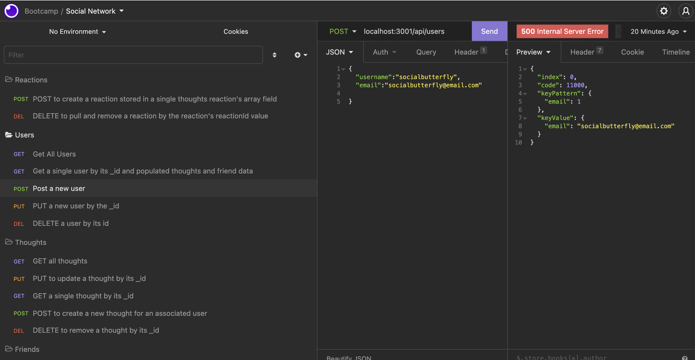

# SocialNetwork


## Description
This application demonstrates the build and function of APIs for a social network web application where users can share their thoughts, react to friends’ thoughts, and create a friend list. This application uses Express.js for routing, a MongoDB database, and the Mongoose ODM. 

Highlights for this project:
- Developed using Node.js, Express, MongoDB
- Demonstration of GET, POST, PUT, and DELETE API calls 

## Table of Contents
- [User Story](#user-story)
- [Installation](#installation)
- [Usage](#usage)
- [License](#license)
- [Contributing](#contributing)
- [Tests](#tests)
- [Video Walkthrough](#video-walkthrough)
- [Questions](#questions)

## User-Story

```md
AS A social media startup
I WANT an API for my social network that uses a NoSQL database
SO THAT my website can handle large amounts of unstructured data
```
## Installation
To use this code as your own you will need to install Node.js and install NPM package dependencies. You will need to sign up with MongoDB and install the MongoDB Compass.  Additionally, to test the APIs, you can use Insomnia or a similar program.

Consider creating .gitignore file and include .env file node_modules so that your information is not tracked or uploaded to a repository in the future. Be sure to create your .gitignore file before installing any npm dependencies.


## Usage
After running 'NPM Start' to being to the server, open Insomnia to test the various APIs available for the network.



Below are sample API Routes that can be tested:
**`/api/users`**

* `GET` all users

* `GET` a single user by its `_id` and populated thought and friend data

* `POST` a new user:

```json
// example data
{
  "username": "socialbutterfly",
  "email": "socialbutterfly@email.com"
}
```

* `PUT` to update a user by its `_id`

* `DELETE` to remove user by its `_id`

---

**`/api/users/:userId/friends/:friendId`**

* `POST` to add a new friend to a user's friend list

* `DELETE` to remove a friend from a user's friend list

---

**`/api/thoughts`**

* `GET` to get all thoughts

* `GET` to get a single thought by its `_id`

* `POST` to create a new thought (don't forget to push the created thought's `_id` to the associated user's `thoughts` array field)

```json
// example data
{
  "thoughtText": "Here's a new thought!",
  "username": "socialbutterfly",
  "userId": "5edff358a0fcb779aa7b118b"
}
```

* `PUT` to update a thought by its `_id`

* `DELETE` to remove a thought by its `_id`

---

**`/api/thoughts/:thoughtId/reactions`**

* `POST` to create a reaction stored in a single thought's `reactions` array field

**`/api/thoughts/:thoughtId/reactions/:reactionId`**
* `DELETE` to pull and remove a reaction by the reaction's `reactionId` value


## License
This application is covered under the [License: MIT](https://opensource.org/licenses/MIT).


## Contributing
Resources from this project:
- Node.js
- Express
- Insomnia
- MongoDB


## Tests
No test scripts for this application.


## Video Walkthrough
[Video Walkthrough](https://watch.screencastify.com/v/X2TpFVYr77A1noxnIm53)

## Questions
Contact Details:

- GitHub profile: [mel-ificent](https://github.com/mel-ificent)
- For additional questions, you can contact me via email: melissadonato11@gmail.com